# 🔹 Timeline Scenario: E-Commerce Data Flow with Linux, Hadoop, HDFS, HBase, Hive & ZooKeeper  

This document explains how different big data components work together in an **E-commerce system** using a timeline scenario.  

---

## 📌 1. User Activity on E-commerce Website  
- Customers browse products, add to cart, place orders, write reviews, and search for items.  
- Data generated includes: clicks, searches, order history, inventory updates, and user behavior logs.  

---

## 📌 2. Linux – The Foundation  
- The entire big data ecosystem runs on **Linux servers** (stable, open-source, cost-effective).  
- Admins manage the cluster, start/stop services, and run scripts using **Linux CLI commands**.  
- Example:  
  ```bash
  systemctl start hadoop
  hdfs dfs -ls /
  ```

---

## 📌 3. Hadoop & HDFS – Storing E-commerce Data  
- All raw data (orders, product images, logs, transactions) flows into **HDFS (Hadoop Distributed File System)**.  
- HDFS splits huge files into **blocks** and distributes them across multiple machines for fault tolerance.  
- Example: A 10GB clickstream log file is broken into 128MB blocks and stored across DataNodes.  

---

## 📌 4. ZooKeeper – Cluster Coordinator  
- As multiple Hadoop services run, **ZooKeeper** ensures coordination.  
- It keeps track of:  
  - Which DataNode is alive?  
  - Which HBase Master is active?  
  - Lock management for distributed tasks.  

---

## 📌 5. HBase – Real-time Order & Inventory Database  
- E-commerce needs **real-time reads/writes** (e.g., check stock before placing an order).  
- HBase (NoSQL) stores:  
  - User profiles  
  - Order transactions  
  - Product inventory levels  
- Example: When a user orders a laptop, HBase immediately updates inventory count.  

---

## 📌 6. Hive – Business Analytics Data Warehouse  
- Managers/analysts don’t need raw NoSQL data → they need insights.  
- Hive runs on top of Hadoop, allowing SQL-like queries over large datasets.  
- Example queries:  
  ```sql
  SELECT product, COUNT(*) as total_sales  
  FROM orders  
  WHERE order_date >= '2023-08-01'  
  GROUP BY product  
  ORDER BY total_sales DESC  
  LIMIT 10;
  ```

---

## 📌 7. End-to-End Data Flow Example  
🔹 A customer buys a phone →  
1. Transaction stored in **HBase** (fast, real-time).  
2. Product catalog images/logs stored in **HDFS**.  
3. Analysts run **Hive SQL queries** on Hadoop to generate reports.  
4. **ZooKeeper** keeps everything synchronized.  
5. All runs on **Linux servers**.  

---

## 📊 Visual Timeline (Markdown Diagram)

```mermaid
sequenceDiagram
    participant User as 👤 User (Customer)
    participant Linux as 🐧 Linux OS
    participant HDFS as 📂 Hadoop HDFS
    participant Zoo as 🦓 ZooKeeper
    participant HBase as 📘 HBase (NoSQL)
    participant Hive as 📊 Hive (Analytics)

    User->>Linux: Interacts with E-commerce app
    Linux->>HDFS: Store logs, images, transactions
    Zoo->>HDFS: Coordinate DataNodes
    Linux->>HBase: Real-time order & inventory updates
    Zoo->>HBase: Manage master/slave coordination
    HDFS->>Hive: Provide stored raw data
    Hive->>Linux: Run SQL-like queries for reports
    Hive->>User: Business insights (Top products, Revenue)
```



---

## ⚡ Summary  
- **Linux** = Operating system foundation  
- **Hadoop + HDFS** = Big data storage backbone  
- **ZooKeeper** = Coordinator ensuring services don’t conflict  
- **HBase** = Real-time NoSQL for transactions  
- **Hive** = SQL-like analytics for business insights  

👉 Together, they enable an **E-commerce platform** to handle **millions of users, products, and orders** smoothly.  
